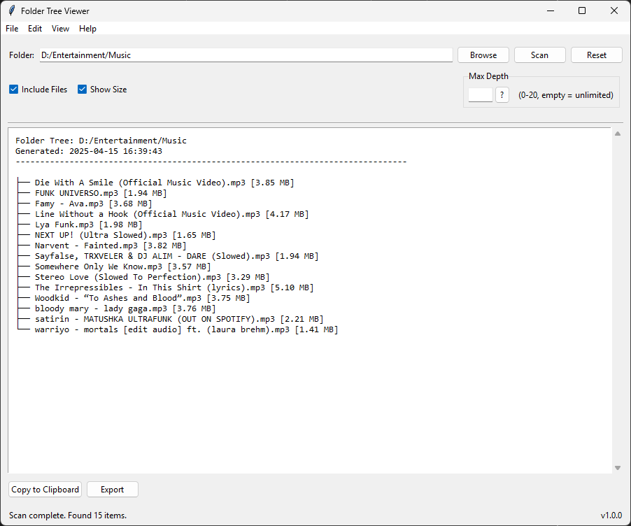

# 🌳 Folder Tree Viewer

<div align="center">


A professional utility for visualizing folder structures with a modern, user-friendly interface.

[Features](#features) • [Installation](#installation) • [Usage](#usage) • [Contributing](#contributing)

</div>

<p align="center">
  
</p>

---

## ✨ Features

### 🗂️ Core Functionality

- **📁 Folder Tree Visualization**: View complete folder structures with customizable depth
- **🔍 Smart Depth Control**: 
  - Unlimited depth scanning
  - Configurable depth limits (0-20)
  - Real-time depth validation
  - Performance-optimized scanning
- **📄 File Management**:
  - Include/exclude files in the tree view
  - Show file sizes with automatic formatting
  - Handle large directories efficiently
  - Support for deeply nested structures

### 📤 Export Options

- **📝 Multiple Export Formats**:
  - Text file export (TXT)
  - JSON export with full structure
  - CSV export for spreadsheet compatibility
  - Clipboard copy support
- **⚙️ Export Settings**:
  - Remember last export location
  - Customizable export formats
  - Batch export capabilities

### 🖥️ User Interface

- **🎨 Modern Design**:
  - Clean, intuitive interface
  - Responsive layout
  - Drag and drop support
  - Progress indicators
- **🔗 Navigation Features**:
  - Favorites system
  - Recent folders history
  - Quick folder access
  - Folder management tools

### 🛠️ Customization

- **👁️ View Options**:
  - Adjustable tree depth
  - File inclusion toggle
  - Size display options
  - Custom formatting
- **🌐 Language Support**:
  - English (default)
  - Spanish
  - French
  - German
  - Easy to add more languages

### 🚀 Advanced Features

- **🛡️ Error Handling**:
  - Graceful error recovery
  - User-friendly error messages
  - Automatic state preservation
  - Crash prevention
- **⚡ Performance**:
  - Asynchronous scanning
  - Memory-efficient processing
  - Background operations
  - Progress tracking

## 🚀 Installation

1. Ensure you have Python 3.6+ installed

2. Install required packages:
   
   ```bash
   pip install tkinterdnd2
   ```

3. Run the application:
   
   ```bash
   python folder_tree_viewer.py
   ```

## ⚠️ Antivirus Detection Notice

> **Important**: When downloading the executable (.exe) file, your antivirus software may flag it as a potential threat. This is a **false positive** and the application is completely safe to use. This happens because:
> 
> 1. The application is not digitally signed
> 2. It's a Python application packaged as an executable
> 3. It accesses the file system to scan folders
> 
> ### How to safely download and use the application:
> 
> 1. **Temporarily disable your antivirus** before downloading
> 2. Download the file from the [releases page](https://github.com/NikhilAtrey/folder-tree-viewer/releases)
> 3. Add an exception in your antivirus for the downloaded file
> 4. Re-enable your antivirus
> 
> Alternatively, you can build the application yourself using the [installation instructions](#-installation) above, which will avoid antivirus detection entirely.

## 📖 Usage

### 🔰 Basic Operations

1. **Opening Folders**:
   
   - Click "Browse" to select a folder
   - Drag and drop folders onto the window
   - Use Favorites or Recent folders

2. **Viewing Options**:
   
   - Set max depth (0-20, empty for unlimited)
   - Toggle file inclusion
   - Show/hide file sizes
   - Customize view settings

3. **Exporting**:
   
   - Use Export button for multiple formats
   - Copy to clipboard
   - Save as text/JSON/CSV
   - Configure export settings

### 🔧 Advanced Features

1. **Favorites Management**:
   
   - Add folders to favorites
   - Organize favorite folders
   - Quick access to common locations
   - Remove or reorder favorites

2. **Recent Folders**:
   
   - Automatic history tracking
   - Quick access to recent locations
   - Clear history option
   - Persistent storage

3. **Settings**:
   
   - Configure default depth
   - Set export location
   - Choose interface language
   - Update preferences

## ⌨️ Keyboard Shortcuts

| Shortcut       | Action            |
| -------------- | ----------------- |
| `Ctrl+O`       | Open folder       |
| `Ctrl+E`       | Export as text    |
| `Ctrl+Shift+E` | Export as JSON    |
| `Ctrl+Shift+C` | Export as CSV     |
| `Ctrl+C`       | Copy to clipboard |
| `Ctrl+A`       | Select all        |
| `Ctrl+R`       | Reset application |
| `Ctrl+,`       | Open settings     |
| `F5`           | Refresh view      |

## 🛡️ Error Handling

The application includes comprehensive error handling for:

- 🚫 Invalid folder paths
- 🔒 Permission errors
- 📂 Empty directories
- 🌳 Deeply nested structures
- ⚡ Rapid UI interactions
- 🗑️ Sudden folder removals
- 📤 Export failures
- ⚙️ Configuration issues

## 🤝 Contributing

Contributions are welcome! Please feel free to submit a Pull Request.

1. Fork the repository
2. Create your feature branch (`git checkout -b feature/amazing-feature`)
3. Commit your changes (`git commit -m 'Add some amazing feature'`)
4. Push to the branch (`git push origin feature/amazing-feature`)
5. Open a Pull Request

## 📄 License

This project is licensed under the MIT License - see the [LICENSE](LICENSE) file for details.

---

<div align="center">

Made with ❤️ by Nikhil

[⬆ Back to top](#folder-tree-viewer)

</div>
